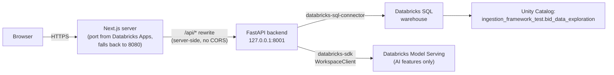

# 01: Architecture

## What this app is

The TAQA Bid Analyzer is a commercial bid-analysis tool for TAQA/ADDC (Abu
Dhabi power & water distribution utility) procurement. It reads real
tender (RFQ) and vendor-bid data that has already been ingested from IBM
Maximo into Databricks Unity Catalog, and layers a comparison, analysis,
and negotiation-prep workflow on top of it, without ever writing back
into the Maximo-owned tables.

It is built and deployed as a single **Databricks App**: one container
running both a FastAPI backend and a Next.js frontend, reading from (and,
for its own app-owned data, writing to) a Databricks SQL warehouse over
Unity Catalog.

## High-level request flow



Both processes run in the same container (see
[08-deployment-operations.md](08-deployment-operations.md)). The browser
only ever talks to the Next.js server's externally-exposed port; the
`/api/*` rewrite in `frontend/next.config.ts` forwards those requests
server-side to FastAPI on `127.0.0.1:8001`, which is never exposed
externally. This means there is no CORS to configure for the deployed
app; CORS middleware exists in `backend/main.py` only for local dev,
where the two dev servers run on different ports (3000 and 8001).

## Tech stack

| Layer | Technology |
|---|---|
| Backend | Python 3.11, FastAPI, uvicorn |
| Database access | `databricks-sql-connector` (SQL warehouse queries), `databricks-sdk` (`WorkspaceClient`, credential auto-detection, Model Serving) |
| Frontend | Next.js (App Router), React, TypeScript, Tailwind CSS |
| UI primitives | A small shadcn-style component set (`Badge`, `Button`, `Card`) under `frontend/src/components/ui/` |
| Charts | Recharts (round-over-round trend line chart) |
| Icons | `lucide-react` |
| Excel export | `openpyxl` |
| AI features | Databricks Model Serving (`databricks-claude-haiku-4-5`), accessed via `WorkspaceClient().serving_endpoints.query()`; no external LLM API |
| Data platform | Databricks Unity Catalog, catalog `ingestion_framework_test`, schema `bid_data_exploration` |

## The core architectural principle: read-only Maximo, additive app data

Everything the app knows about tenders and vendor bids comes from
Maximo-ingested tables (`rfq`, `rfqvendor`, `quotationline`, `companies`,
`DISCOUNTHISTORY`, `DISCOUNTHISTORYLINE`); see
[04-data-model.md](04-data-model.md). These are treated as **strictly
read-only**. The app never runs `UPDATE`/`DELETE`/`INSERT` against any of
them, for two reasons: they're the ingestion pipeline's output, not this
app's to own, and Maximo itself remains the system of record for
procurement.

Every feature that needs to record something the app itself produces
(a manual price correction, a disqualification, a partial-bid flag, a
project, a user identity) writes instead into a small set of
**app-owned overlay tables**, all prefixed `bid_analyzer_*`, living in
the same Unity Catalog schema. These are:

- Append-only (never `UPDATE`/`DELETE`; a "change" is a new row)
- "Latest row wins" for a given key, resolved in Python after `ORDER BY
  ... ASC`, not in SQL
- Applied at **display time**, as an overlay joined onto the real Maximo
  data inside `backend/api/comparison.py`; the underlying Maximo query
  never changes

See [04-data-model.md](04-data-model.md) for the full schema of each
overlay table, and [06-business-logic.md](06-business-logic.md) for the
shared patterns (fail-open fetches, the "OR enforcement" rule) that make
this safe.

## Directory structure

```
bid_analyzer_demo/
  backend/
    main.py                    # FastAPI app, router mounting, CORS, /health
    db.py                      # Databricks SQL connection helper
    boq_classification.py      # in-process cached RFQ BOQ-richness classifier
    api/
      rfqs.py                  # GET /api/rfqs (browse/search)
      users.py                 # POST /api/users/identify
      projects.py              # /api/projects (CRUD-lite)
      comparison.py            # GET /api/rfqs/{rfqnum}/comparison  <- the core engine
      corrections.py           # POST .../corrections
      disqualifications.py     # POST .../disqualifications
      partial_bids.py          # POST .../partial-bids
      round_snapshots.py       # shared forward-fill reconstruction
      rounds.py                # GET .../rounds
      negotiation_report.py    # GET .../negotiation-report(.xlsx)
      negotiation_narrative.py # POST .../negotiation-report/narrative (AI)
      beta_pricing.py          # POST .../comparison/beta (AI)
      llm_client.py            # shared Model Serving endpoint config
  frontend/
    src/
      app/
        layout.tsx              # nav shell
        page.tsx                 # "/": Projects landing page
        rfqs/page.tsx             # "/rfqs": RFQ browse/search
        projects/[id]/
          page.tsx                       # server wrapper (async params)
          project-detail-client.tsx      # tab shell (Comparison/Rounds/Report)
          rfq-comparison.tsx             # BOQ Comparison tab
          round-tracking.tsx             # Round Tracking tab
          negotiation-report.tsx         # Negotiation Report tab + AI summary
      lib/
        api.ts, identity.ts, format.ts, boq-category.ts, orgs.ts, rounds.ts, utils.ts
      components/ui/          # Badge, Button, Card
    next.config.ts             # /api/* rewrite to FastAPI
  databricks/
    FINDINGS.md                # the running data-exploration + design log
    schema/                    # DDL for every bid_analyzer_* table
  data/, project_details/      # sample bid documents, business-case materials
  app.yaml, start.sh           # Databricks Apps deployment
  pyproject.toml               # Python deps (uv)
```

## Why this shape

- **One deployable unit, two processes.** Databricks Apps exposes one
  port; running FastAPI and Next.js as two processes in the same
  container, joined by a server-side rewrite, avoids needing a second
  externally-routable service or a reverse proxy.
- **No dedicated database migrations tool.** App-owned tables are
  created lazily via `CREATE TABLE IF NOT EXISTS`, run inline on the
  write path that needs them (not on every read); see
  [10-development-guide.md](10-development-guide.md) for the convention
  to follow when adding a new one.
- **No ORM.** Every query is a hand-written, parameterization-avoided
  (see `escape_sql_literal`) SQL string against `databricks-sql-connector`.
  This is a deliberate simplicity choice for a relatively small,
  read-heavy app talking to a warehouse rather than a transactional
  database; see [06-business-logic.md](06-business-logic.md) for the
  SQL-injection posture this implies and how it's mitigated.
- **No real authentication.** "Identity" is either a Databricks
  Apps-forwarded header (unverified whether this platform actually sends
  one) or a self-reported display name cached in `localStorage`. The
  real access boundary is already being an authorized user in TAQA's
  Databricks workspace, which is required to reach the app at all; see
  [06-business-logic.md](06-business-logic.md).

## Where to go next

- The two most complex pieces of business logic each get their own
  chapter: [02-boq-comparison-engine.md](02-boq-comparison-engine.md) and
  [03-round-negotiation-tracking.md](03-round-negotiation-tracking.md).
- For "what table has what column," see
  [04-data-model.md](04-data-model.md).
- For "what does each backend module do," see
  [05-application.md](05-application.md).
