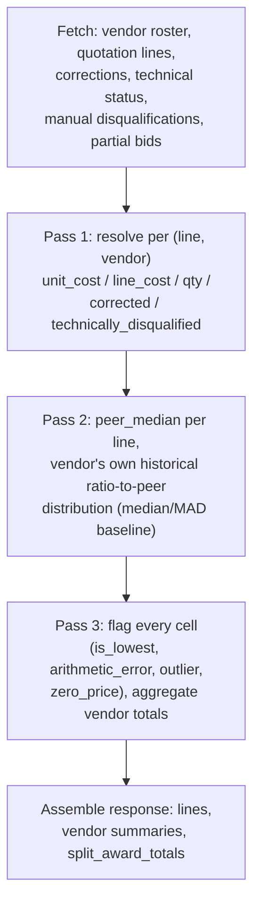

# 02: The BOQ Comparison Engine

This is the single most complex piece of business logic in the app,
`backend/api/comparison.py`'s `build_comparison()`, so it gets its own
chapter. Every other feature (negotiation report, AI narrative, Beta
pricing, round tracking's per-line reuse) is built on top of what this
function produces.

## What it answers

Given an RFQ, produce a side-by-side table of every vendor's price on
every BOQ line, with every commercial red flag pre-computed: unquoted
lines, arithmetic errors, statistical outliers, zero-priced lines,
technical/manual disqualification, and, new in the most recent work,
partial-bid handling. It also produces per-vendor contract totals, a
"lowest" determination, and a line-by-line split-award total.

## The three-pass architecture

`build_comparison()` processes the whole BOQ in three passes because
outlier detection (pass 2) needs to see a vendor's **entire** pricing
history before it can judge whether any single line is unusual for that
vendor specifically: you can't flag an outlier line-by-line in one pass
without knowing the vendor's overall pattern first.



### Pass 1: resolve raw values per cell

For each `(rfqlinenum, vendor)` pair, resolve:

- `unit_cost` / `line_cost` / `qty`: from `quotationline` directly for
  the `"original"` round, or derived from a round snapshot for any later
  round (see [03-round-negotiation-tracking.md](03-round-negotiation-tracking.md))
- Whether a **manual price correction** exists and, if so, overrides the
  raw price
- Whether the cell is **technically disqualified** (either by Maximo's
  own `QL2 = 'TNA'` status, or by a manual disqualification overlay
  entry), and if so, by which source, with what reason, by whom

This pass produces `resolved_by_line: dict[float, dict[str, dict]]`, the
input to everything after it.

### Pass 2: build the outlier baseline

**Why not a flat "50% away from peer median" check?** An earlier version
of this logic did exactly that, and it produced false positives: a
vendor who is simply priced 2-3x higher (or lower) than the group across
the *entire* BOQ (common in real construction bidding) got flagged as
an outlier on nearly every line. That's their overall price level, not a
per-line anomaly.

The fix: compute, for each line, the **peer median** unit cost (excluding
technically-disqualified cells, requiring at least `OUTLIER_MIN_QUOTES =
3` real quotes). Then compute each vendor's own historical distribution
of **ratio-to-peer-median** across every line they priced. A vendor who's
consistently 2.5x the peer median has a tight, high baseline ratio, and
is *not* flagged just for being expensive. A vendor whose ratio spikes
wildly on one particular line, relative to their own normal pattern, is
what actually gets flagged.

The baseline itself uses **median and MAD (median absolute deviation)**,
a "modified z-score" (Iglewicz & Hoaglin), not mean/stdev. A plain
mean/stdev z-score was tried and rejected: one huge outlier inflates its
own stdev enough to shrink its own z-score back under the threshold,
effectively masking itself. Median/MAD resists that: a single extreme
point barely moves either the median or the median of deviations.

```
z = 0.6745 * |ratio_to_peer_median - vendor's_median_ratio| / vendor's_MAD
```
(`0.6745` scales MAD to be comparable to a standard deviation for
normally-distributed data; the standard modified z-score constant.)

A vendor needs at least `MIN_LINES_FOR_VENDOR_BASELINE = 5` peer-
comparable lines before a baseline is trusted at all; below that, they
get no outlier flags rather than a noisier fallback. The MAD itself is
floored at `MAD_FLOOR_FRACTION = 0.03` (3% of the median ratio) so a
vendor whose historical ratio happens to be extremely tight doesn't have
a trivial wobble amplified into an apparent infinite anomaly by a
near-zero denominator.

`OUTLIER_Z_THRESHOLD = 3.0` is the cutoff, and **at most one outlier is
surfaced per line**: every vendor's z-score is computed as a candidate,
and only the single largest that clears the threshold is kept, even if
more than one vendor deviates on the same line.

### Pass 3: flag every cell and aggregate

For each line, `min_line_cost` is computed excluding technically-
disqualified cells (a disqualified price is real but out of commercial
play). Then per vendor per line:

| Flag | Condition |
|---|---|
| `unquoted` | No `unit_cost` (original round) / no `line_cost` (later round) |
| `zero_price` | Not corrected, not disqualified, `unit_cost == 0` |
| `is_lowest` | Not disqualified, non-zero, matches `min_line_cost` |
| `arithmetic_error` | Original round only, not corrected, not disqualified, `\|line_cost - qty × unit_cost\| > 0.01` |
| `outlier` | This vendor is the single line's designated outlier from pass 2 |

Vendor-level aggregates accumulate alongside: `vendor_totals` (sum of
`line_cost`, excluding disqualified lines), `vendor_unquoted`,
`vendor_errors`, `vendor_outliers`, `vendor_zero_price`,
`vendor_disqualified`.

## Technical disqualification (QL2 = "TNA")

`quotationline`/`altquotationline` carry a `QL2` status column, confirmed
as a real technical-acceptance field with values `QUOTED` / `TNA` /
`NOQUOTE` / `Cancel` / `CNA`. Only `TNA` ("Technically Not Accepted") is
treated as disqualifying, an explicit product decision, not an
inference from Maximo documentation.

**Known caveat, built anyway per an explicit decision not to block on
verifying it first**: `QL2`'s value distribution was only directly
confirmed on `altquotationline` (a smaller, non-construction sample);
whether it's populated the same way on `quotationline` for a real
detailed construction BOQ is unverified. `_fetch_technical_status()` is
**fail-open**: if the column doesn't exist or the query fails for any
other reason, disqualification is simply never applied rather than
breaking the whole comparison view.

A disqualified cell is excluded from `is_lowest`, `contract_total`, the
outlier baseline, and every other commercial computation, but it is
still shown (strikethrough, not hidden), so the analyst can see why a
real submitted price isn't in play.

## Manual disqualification: "add-only relative to Maximo"

An analyst can disqualify a line themselves, for a reason `QL2` doesn't
capture (`backend/api/disqualifications.py`,
`bid_analyzer_line_disqualifications`), app-only, never written back to
`quotationline`.

The critical design point: this is **add-only relative to Maximo**. The
two sources merge with a plain boolean `OR`:

```python
technically_disqualified = ql2_disqualified or manual_disqualified
```

That single line is the *entire* enforcement of "an analyst can flag
something QL2 never caught, and can undo their own manual entry, but can
never re-qualify a real `QL2='TNA'` rejection back to qualified." No
special-case validation code exists in the write endpoint to block that
case: a `disqualified=false` write against a `QL2='TNA'` line is
accepted and stored, it just has zero effect on the merged result,
because Maximo's side of the `OR` is still `true`. This was verified
directly: writing `disqualified=false` against a `QL2='TNA'` line and
confirming the cell stays disqualified.

## Partial bids: a whole-vendor flag, not a per-line one

The newest addition: an analyst can mark a **vendor's entire bid on this
RFQ** as a deliberate partial-scope submission (e.g. they only bid one
lot of a multi-lot tender), via a checkbox: `backend/api/partial_bids.py`,
`bid_analyzer_partial_bids`, keyed on `(rfqnum, vendor)` with no
`rfqlinenum`, since this is a whole-vendor concept.

Marking a vendor partial changes three things about how they're
compared, all computed from data `build_comparison()` already has:

1. **`unquoted_count` is suppressed to 0** in the vendor summary: an
   unquoted line is expected for a partial bidder, not a red flag. The
   real count is still recoverable via `quoted_line_count`
   (`total_line_count - raw unquoted count`), it's just not surfaced as
   a badge.
2. **`quoted_line_count` is exposed** so the frontend can annotate the
   contract total ("Partial bid: 42 of 620 lines") rather than let it
   look directly comparable to a full-scope bidder's total.
3. **Excluded from the "Lowest" badge**: this is a *frontend*
   computation (`rfq-comparison.tsx`'s `lowestTotal` is `Math.min` over
   non-partial vendors only). A partial bidder can still win individual
   lines and appear in the split-award table on whatever they did bid;
   only the aggregate "cheapest overall" badge is affected.

The `contract_total` number itself is **never altered** by this flag;
only its presentation and badge-eligibility change. Per-line `is_lowest`
and split-award math are completely unaffected, since a partial bidder
legitimately winning a subset of lines (and being split-awarded that
subset) is a real, valid procurement outcome.

## Split-award totals

A second, independent aggregate: if every line were awarded individually
to whoever's cheapest *technically-accepted* bidder on that specific
line, what would each vendor actually be paid? Computed by summing
`line_cost` for every cell where `is_lowest` is true, grouped by vendor.
On an exact tie, every tied vendor is credited for that line; there's no
principled way to pick a single winner between identical prices, so the
tie is left visible rather than arbitrarily broken.

## Manual price corrections

`backend/api/corrections.py` / `bid_analyzer_price_corrections` lets a
user fix a wrong or missing price inline. A corrected cell:

- **Is trusted**: excluded from `arithmetic_error`/`outlier`/`zero_price`
  flagging, since a person has already reviewed it
- **Still fully participates** in `is_lowest` and `contract_total`; that
  is the point of correcting it
- Is **original-round only**. `DISCOUNTHISTORYLINE` only carries a
  post-discount `LINECOSTWDIS`, no per-round unit rate, so a correction
  fixing one specific bad entry doesn't carry a round of its own;
  reapplying the same absolute price at a later negotiation round would
  misrepresent whatever real discount happened since.

## Round-scoped view

An optional `?round=` query parameter (default `"original"`) re-renders
the same comparison at any later negotiation revision, reusing
`round_snapshots.build_round_snapshots()` (shared with
[03-round-negotiation-tracking.md](03-round-negotiation-tracking.md)).
Because a non-original round's `unit_cost` is *derived*
(`line_cost / qty`, since only a post-discount line total is stored, not
a rate), the `arithmetic_error` check is meaningless there and is
hardcoded `False` for every round except `"original"`.

## Constants reference

| Constant | Value | Purpose |
|---|---|---|
| `LINES_CAP` | 500 | Max lines returned per response (aggregates still computed over the full set) |
| `ARITHMETIC_TOLERANCE` | 0.01 | AED tolerance before `line_cost ≠ qty × unit_cost` counts as an error |
| `OUTLIER_MIN_QUOTES` | 3 | Min real quotes on a line before a peer median is trusted |
| `MIN_LINES_FOR_VENDOR_BASELINE` | 5 | Min peer-comparable lines before a vendor's outlier baseline is trusted |
| `OUTLIER_Z_THRESHOLD` | 3.0 | Modified z-score cutoff for flagging an outlier |
| `MAD_FLOOR_FRACTION` | 0.03 | Floor on a vendor's MAD, as a fraction of their baseline ratio |
| `DISQUALIFYING_QL2_VALUES` | `{"TNA"}` | Which `QL2` values count as a technical disqualification |
