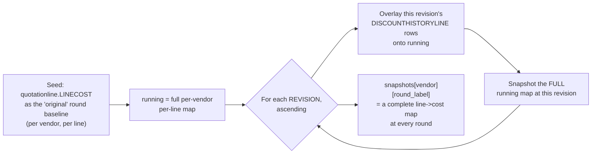

# 03 — Round-over-Round Negotiation Tracking

The second flagship piece of business logic: reconstructing a vendor's
full pricing history across every negotiation round, from data that was
never designed to make that easy, and using it to flag anomalous
movement between rounds.

## The problem this solves

`quotationline` (the priced BOQ line items) has **no round-number column
and no change-timestamp**. Real data confirmed this directly: on one
large BOQ, `LINECOST` (original quote) differs from `LINECOSTWDIS`
(post-discount price) on 46% of lines, with `DISCOUNT_PERCENT` varying
per line — but the table only ever shows the *net* before/after state.
If there were multiple negotiation rounds in between, the intermediate
ones are silently overwritten, not preserved, in this table.

The real round history lives in two separate tables, first used in this
codebase for exactly this purpose:

- **`DISCOUNTHISTORY`** — one row per `(RFQNUM, VENDOR, REVISION)`, an
  event/header record of a round happening
- **`DISCOUNTHISTORYLINE`** — per-line post-discount price
  (`LINECOSTWDIS`) at a given revision

## The one real design risk, handled by construction

**Unknown, and unverifiable without live data at build time**: is each
`REVISION`'s set of `DISCOUNTHISTORYLINE` rows a *full snapshot* of every
line the vendor has ever priced, or only the lines that *changed* at that
revision?

Rather than guessing, `backend/api/round_snapshots.py`'s
`build_round_snapshots()` is written to be correct either way, via a
**forward-fill reconstruction**:

A running per-vendor, per-line dict is seeded from `quotationline`'s
original quote. Each revision, in ascending order, overlays whatever
rows it has onto that running map — updating only the lines it mentions
— and then the *entire* running map is snapshotted under that revision's
label. If a vendor never revised a given line at some round, the
snapshot simply carries forward its last known value.

This produces correct per-round contract totals in both possible cases:
if revisions are always full snapshots, each overlay is just a no-op
replace of already-current values; if revisions are deltas, the forward
fill reconstructs the missing untouched lines correctly. Verified in the
scratchpad test suite with both fixture shapes producing identical
totals.

Because this reconstruction is needed by two different features
(round-over-round trend, and `comparison.py`'s `?round=` parameter), it
lives in its own module rather than either of theirs — `rounds.py`
already imports from `comparison.py` (`_fetch_vendor_roster`), so
`comparison.py` can't also import from `rounds.py` without a circular
import.

## `GET /api/rfqs/{rfqnum}/rounds` — the trend + flags

`backend/api/rounds.py`'s `build_round_trend()`:

1. Calls `build_round_snapshots()` for the reconstructed per-round data
2. For each vendor, builds a `RoundPoint` series (one point per round:
   contract total = sum of that round's snapshot, plus a display date
   from `DISCOUNTHISTORY.DISCOUNT_APPLY_DATE` or `ENTERDATE`)
3. Compares **every pair of consecutive present rounds**, per vendor, per
   line, computing a price ratio, and applies two flag rules

### Rule 1 (critical) — any round-over-round price increase

Negotiation rounds should only ever move a price down. Any line where
`val2 - val1 > INCREASE_TOLERANCE` (1 AED, to ignore float noise) and the
ratio exceeds `1.001` is flagged critical, with the exact before/after
value and ratio in the detail text.

### Rule 2 (warning) — a discount far steeper than peers on the same line

Possible front/back-loading: a vendor discounting one particular line
*much* more steeply than other vendors did on that same line, between
the same two rounds, rather than an even discount across their bid. For
each line with at least `PEER_MIN_SAMPLE = 3` vendors who both have a
ratio at that round transition, compute the **peer median ratio**. Any
vendor whose own ratio is less than `1 / PEER_DEVIATION_THRESHOLD` (i.e.
more than 4x steeper) than the peer median is flagged warning. Lines
already caught by Rule 1 (a ratio ≥ 1.001, i.e. an increase) are
excluded here.

## Reused everywhere else

`build_round_trend()` and `build_round_snapshots()` are called
**in-process**, not over HTTP, by:

- `backend/api/comparison.py` — for the `?round=` query parameter on the
  BOQ comparison view
- `backend/api/negotiation_report.py` — folds `round_critical_count` /
  `round_warning_count` and the flag details straight into each vendor's
  negotiation-prep summary, alongside the BOQ-level flags from
  [02-boq-comparison-engine.md](02-boq-comparison-engine.md)

This in-process reuse (a plain Python function call, not a second HTTP
round trip to the app's own API) is a deliberate pattern used throughout
the backend — see [05-application.md](05-application.md).

## Frontend: the trend chart

`frontend/src/app/projects/[id]/round-tracking.tsx` renders:

- A Recharts line chart of contract total per round, one line per vendor
  — capped at the top `MAX_CHART_LINES = 5` vendors by final-round total
  (more than 5 series becomes visually indistinguishable; anything past
  the 5th is table-only, not a 6th generated color)
- A full contract-totals table (every vendor, every round — the "relief"
  view for whatever didn't make the chart)
- A severity-filterable table of every anomaly flag

Chart colors come from the `dataviz` skill's validated reference
categorical palette (`--chart-1..5` CSS custom properties in
`globals.css`) — fixed hue order, never cycled, the first real chart to
actually use a validated palette in this app.

## Known unverified assumptions

- `DISCOUNTHISTORY`/`DISCOUNTHISTORYLINE`'s fully-qualified location is
  assumed to match the rest of the schema
  (`ingestion_framework_test.bid_data_exploration`) — never independently
  confirmed against a live deployment at the time this was built.
- Whether `REVISION`'s rows are full-snapshot or delta-only is still
  unknown — mitigated by construction (the forward-fill), not resolved.
- `RECORDTYPE`/`STAGE` columns on these tables exist but are unused —
  meaning unclear, not investigated.

See [09-troubleshooting.md](09-troubleshooting.md) if either of these
tables 503s in a real deployment.
