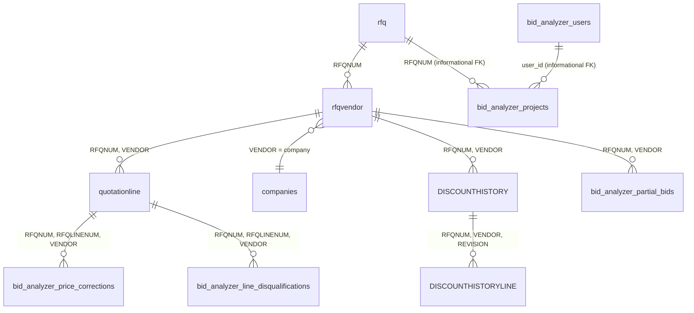

# 04: Data Model

Everything lives in Unity Catalog under `ingestion_framework_test.bid_data_exploration`
(`CATALOG`/`SCHEMA` constants in `backend/db.py`). Two categories of
table: real Maximo-ingested data (read-only), and app-owned overlay
tables (the only thing this app ever writes to).

For the full data-exploration narrative (row counts, distributions,
corrected theories, real-example walkthroughs), see
`databricks/FINDINGS.md`. This chapter is the distilled, current-state
reference.

## Entity relationships

Note: every "FK" from an app-owned table back to Maximo data, or to
another app-owned table, is **informational only**: validated by the
API at write time (a real `SELECT ... LIMIT 1` check), never a database-
level constraint. Unity Catalog Delta tables here don't enforce foreign
keys.

## Maximo-ingested tables (read-only)

Only six tables are actually queried by the app. `altquotationline`,
`docinfo`, `doclinks`, and `vw_rfqvendor_documents` were explored during
data investigation and documented in `FINDINGS.md`, but nothing in the
app queries them.

### `rfq`: tender header (30,338 rows)

| Column | Type | Notes |
|---|---|---|
| `RFQNUM` | varchar(20) | Business key. Format is inconsistent across history (`G1663`, `D-111808`, etc.) |
| `DESCRIPTION` | varchar(254) | Free-text tender description |
| `STATUS` | varchar(50) | Lifecycle status (`CLOSE`, `CANCEL`, `AWDAPV`, `INPRG`, `SENT`, ...) |
| `TENDERSTATUS` | varchar(50) | A separate publish-cycle status; null on ~2/3 of rows (predates whatever process populates it) |
| `ORGID` / `SITEID` | varchar(8) | Spans **7 real orgs** across the legacy group, not just ADDC; `ADDCORG` is the app's default filter |
| `ENTERDATE` | timestamp | Creation-only stamp: **no `CHANGEDATE`**, so a later status change doesn't move this |
| `TOTALAWVALUE` / `TOTALCOST` / `ESTIMATEDCOST` | decimal(18,4) | Null on most rows; award totals live at the vendor/line level instead |
| `DETAILBOQAVAILABLE` | varchar(1) | **Confirmed unreliable**: null even on a real, fully-populated 2,480-line detailed BOQ. The app never uses this; see `boq_classification.py` below |
| `STAGE` | varchar(16) | 100% null across all rows, a dead column |

### `rfqvendor`: one row per invited vendor per RFQ (412,896 rows)

| Column | Type | Notes |
|---|---|---|
| `RFQNUM` | varchar(20) | FK to `rfq` |
| `VENDOR` | varchar(44) | A bare vendor **code** (e.g. `001052`), not a name; resolved via `companies` |
| `BIDSTATUS` / `BIDSTATUSDATE` | varchar(25) / timestamp | Real lifecycle: most invited vendors never submit (`COLLECTED`/`NOT COLLECTED`/`NOT SIGNED` dominate over `SUBMITTED`) |
| `TOTALAWARDCOSTWDIS`, `TOTALAWARDCOSTWITHTAXWDIS` | decimal(16,2) | The usable award-total path, confirmed populated with real values. A parallel set of `binary`-typed columns (`TOTALAWARDCOST` etc.) look encrypted/masked and are unused |
| `DISCOUNT_REVISION`, `POSTBID_DISCOUNT_COUNTER` | decimal | Move in lockstep, the real round-tracking mechanism at the vendor level |

### `quotationline`: priced BOQ line items (1,660,753 rows)

The core table. Joins back to `rfqvendor` via the **composite key**
`(RFQNUM, VENDOR)`; there is no single FK column.

| Column | Type | Notes |
|---|---|---|
| `RFQLINENUM` | decimal(38,10) | A plain sequential line counter, **not** a hierarchical BOQ number |
| `ORDERQTY` / `ORDERUNIT` | decimal / varchar | Quantity and unit. `ORDERUNIT = 'HEADER'` marks a non-priced section-break row, excluded from every query the app runs |
| `UNITCOST` / `LINECOST` | decimal(18,4) | `LINECOST = ORDERQTY × UNITCOST` in real samples |
| `DESCRIPTION` | varchar | Free-text line description. For a large detailed BOQ, this (plus `RFQLINENUM` sequence and `HEADER` markers) is the real structural mechanism, **not** `BOQITEMNUM` |
| `BOQITEMNUM` | varchar(15) | **Not a reliable per-item identifier.** Format is tender-specific; on a real large detailed BOQ it was null on every row. Often a coarse section/lot label (`"LOT 01"`, `"PART 1"`), shared by many distinct lines, when populated at all. **Not used anywhere in this app.** |
| `QL1`-`QL5`, `QL_EXTRA1` | various | Custom extension fields. `QL2` is used as the technical-acceptance status; see [02-boq-comparison-engine.md](02-boq-comparison-engine.md) |
| `ENTERDATE` | timestamp | Creation-only: **no change-timestamp of any kind**. A confirmed gap: real data showed 46% of lines on one BOQ got a discounted price after the original quote, with zero timestamp trail of when |
| `ISAWARDED` | decimal | Confirmed real and granular, tracked per line, per vendor |

### `companies`: vendor code to name

Resolves `rfqvendor.VENDOR` to a real company name:
`SELECT name FROM companies WHERE company = rfqvendor.VENDOR`. **Never
independently profiled** beyond this single join: its full schema,
whether it has any timestamp column, and even its row count are unknown.
First (and only) use of this table in the codebase.

### `DISCOUNTHISTORY` / `DISCOUNTHISTORYLINE`: round history

First used in this codebase for round-over-round tracking (see
[03-round-negotiation-tracking.md](03-round-negotiation-tracking.md)).
Fully-qualified location assumed, not independently verified.

- **`DISCOUNTHISTORY`** (header, one row per `RFQNUM, VENDOR, REVISION`):
  `RFQNUM`, `VENDOR`, `REVISION`, `STAGE`, `ENTERDATE`,
  `DISCOUNT_SUBMISSION_DATE`, `DISCOUNT_APPLY_DATE`, `DESCRIPTION`,
  `ORGID`/`SITEID`, **`ROWSTAMP`**
- **`DISCOUNTHISTORYLINE`** (per-line): `RFQNUM`, `VENDOR`, `REVISION`,
  `RFQLINENUM`, `LINECOSTWDIS`, `DISCOUNT_PERCENT`, `RECORDTYPE`,
  `DESCRIPTION`, `ORGID`/`SITEID`, **`ROWSTAMP`**

`ROWSTAMP` here is Maximo's standard audit/optimistic-lock column, the
one real watermark column confirmed on any table this app uses, making
these two the best candidates for incremental loading if that's ever
needed. `rfq`/`rfqvendor`/`quotationline`/`companies` have no confirmed
equivalent (see the note on `ENTERDATE`'s limits above).

## App-owned overlay tables (the only thing this app writes)

All are Delta tables, `CREATE TABLE IF NOT EXISTS`'d lazily from a `.sql`
file in `databricks/schema/` on the write path that needs them (see
[10-development-guide.md](10-development-guide.md) for the convention).
**None are yet writable in production**: the app's service principal
currently has only `USE CATALOG`/`USE SCHEMA`/`SELECT`; every write
endpoint 503s with a permission error until `CREATE TABLE`/`INSERT`
grants land (see [08-deployment-operations.md](08-deployment-operations.md)).

### `bid_analyzer_users`

| Column | Notes |
|---|---|
| `user_id` | `uuid4().hex`, generated once per distinct identity |
| `display_name` | Shown in the UI |
| `email` | Populated only for a forwarded-platform identity; `NULL` for self-reported users, which keeps the two namespaces from colliding |
| `created_at` | UTC, set in Python |

### `bid_analyzer_projects`

| Column | Notes |
|---|---|
| `project_id` | `uuid4().hex` |
| `user_id` | Informational FK to `bid_analyzer_users` |
| `name` | User-supplied |
| `rfqnum` | Informational FK to `rfq` |
| `created_at` | UTC |

### `bid_analyzer_price_corrections`: append-only, latest wins

| Column | Notes |
|---|---|
| `correction_id` | `uuid4().hex` |
| `rfqnum`, `rfqlinenum` (DOUBLE), `vendor` | The key |
| `unit_cost` | The corrected rate; `line_cost` is *derived* at read time (`qty × this`), never stored, so there's one source of truth |
| `note` | Optional free text |
| `corrected_by`, `corrected_at` | Informational FK + UTC timestamp |

Latest row per `(rfqnum, rfqlinenum, vendor)` wins, resolved in Python
after `ORDER BY corrected_at ASC` (last write in iteration order wins).

### `bid_analyzer_line_disqualifications`: append-only, latest wins

Same shape as corrections, plus `disqualified` (BOOLEAN: `true` to
disqualify, a later `false` row to undo one's own entry) and `reason`
(optional). Keyed on `(rfqnum, rfqlinenum, vendor)`.

### `bid_analyzer_partial_bids`: append-only, latest wins

| Column | Notes |
|---|---|
| `partial_bid_id` | `uuid4().hex` |
| `rfqnum`, `vendor` | The key: **no `rfqlinenum`**, this is a whole-vendor flag |
| `is_partial` | BOOLEAN |
| `note` | Optional free text (e.g. which lots were bid) |
| `marked_by`, `marked_at` | Informational FK + UTC timestamp |

## `boq_classification.py`: a derived, cached view, not a table

Not a table at all: `backend/boq_classification.py` runs a single heavy
`GROUP BY` over all 1.66M `quotationline` rows (average lines per vendor
per RFQ), classifies every RFQ into `detailed_boq` / `shallow` /
`lump_sum` / `no_pricing_data`, and caches the result in-process for
`CACHE_TTL_SECONDS = 15 * 60`. This exists because `rfq.DETAILBOQAVAILABLE`
is confirmed unreliable (see above); the real signal is computed
directly from line-item density. `MIN_BOQ_LINE_ITEMS = 10` is the floor
used everywhere to decide whether an RFQ has a real BOQ worth comparing
at all.
